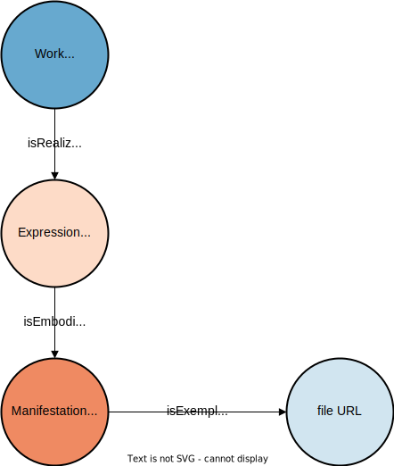

# Abstraction Levels

In JOLux, all the different legislative resources are usually described through **three different levels of abstraction**.

## Work, Expression and Manifestation

:::{admonition} jolux:Work
:class: note
:name: Work
The owl:Class **jolux:Work** is a general abstraction for all the different legal resources in JOLux. All the objects with type jolux:Work have additional types added to differentiate between the diverse legal resources. 

As jolux:Work is a general abstraction, the jolux:Work is *language and file-format agnostic*.
:::

:::{admonition} jolux:Expression
:class: note
:name: Expression
The owl:Class **jolux:Expression** is a *language specific* representation of a jolux:Work. The jolux:Expression is *file-format agnostic*.
:::

:::{admonition} jolux:Manifestation
:class: note
:name: Manifestation
The owl:Class **jolux:Manifestation** is a *file-format specific* representation of a jolux:Expression entity. So an jolux:Manifestation is a *language and file-format specific* representation of a jolux:Work.
:::

So basically, [jolux:Work](#Work), [jolux:Expression](#Expression) and [jolux:Manifestation](#Manifestation) always come together to form a rich representation of a legal resource. 

## Object Properties

The vocabulary used to connect these abstraction levels is as following:

:::{admonition} jolux:isRealizedBy
:class: note
:name: isRealizedBy
The object property **jolux:isRealizedBy** points from a [jolux:Work](#Work) to a [jolux:Expression](#Expression).
:::

:::{admonition} jolux:isEmbodiedBy
:class: note
:name: isEmbodiedBy
The object property **jolux:isEmbodiedBy** points from a [jolux:Expression](#Expression) to a [jolux:Manifestation](#Manifestation).
:::

The following figure shows the different abstraction levels and the object properties to connect them:

:::{figure-md} abs_levels

Relation between jolux:Work, jolux:Expression und jolux:Manifestation.
:::