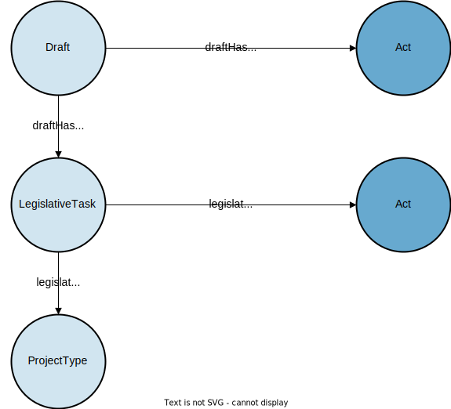

# Chronology

The term **chronology** is used to list all legal resources that are relevant for a specific entry in the [Classified Compilation](classified_compilation.md).

There are different mechanisms how legal resources can be relevant for the chronology:

## Draft

In creating a new legal resource, a [jolux:Draft](#Draft) is created.

:::{admonition} jolux:Draft
:class: note
:name: Draft
A **jolux:Draft** is used to bundle all the activities and documents during the process of drafting a new legal resource.
:::

The following figure shows the general structure of a [jolux:Draft](#Draft):

:::{figure-md} draft_fig


General structure of a jolux:Draft.
:::

The following SPARQL query shows all the [jolux:Act](#Act) that werde involved in drafting the Federal Constitution:

```sparql
PREFIX jolux: <http://data.legilux.public.lu/resource/ontology/jolux#>
SELECT ?act WHERE {
    ?draft jolux:hasResultingLegalResource <https://fedlex.data.admin.ch/eli/oc/1999/404>;
        jolux:draftHasLegislativeTask ?task.
    ?task jolux:legislativeTaskHasResultingLegalResource ?act.
} 
```

## Impact

If new legal resources are created that have an impact on existing ones, they are modelled as [jolux:Impact](#Impact).

The following SPARQL query shows all the [jolux:Act](#Act) that have an impact on the Federal Constitution:

```sparql
PREFIX jolux: <http://data.legilux.public.lu/resource/ontology/jolux#>
SELECT DISTINCT ?act WHERE {
    ?impact jolux:impactFromLegalResource/jolux:legalResourceSubdivisionIsPartOf ?act;
        jolux:impactToLegalResource/jolux:legalResourceSubdivisionIsPartOf <https://fedlex.data.admin.ch/eli/cc/1999/404>.
}
```
